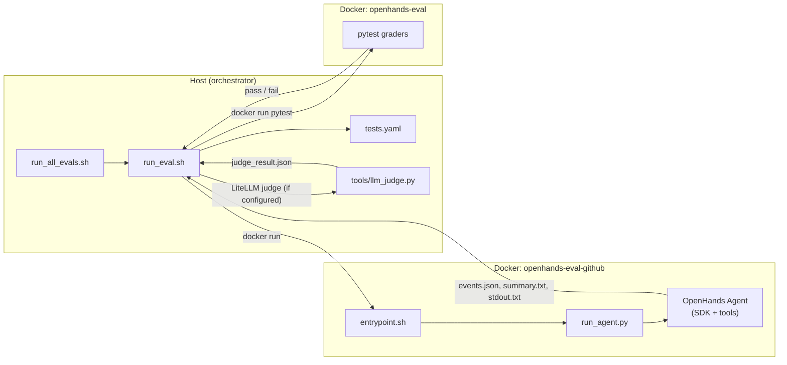

# skill-evals

**A containerized evaluation harness for LLM agent skills, built on the [OpenHands Software Agent SDK](https://github.com/OpenHands/software-agent-sdk).**

Run realistic task prompts against an autonomous agent inside Docker, capture its full tool-use event log, and grade outcomes with a **two-layer validation pipeline**: deterministic pytest oracles on execution traces, plus optional **LLM-as-a-Judge** (LiteLLM) for semantic task quality and safety. This repository ships a reference `github-skill` implementation and tooling to auto-generate test matrices (pytest + judge rubrics) from declarative eval cases.

---

## Architecture & Workflow

The harness separates **agent execution** (non-deterministic LLM behavior) from **grading** (deterministic + optional LLM validation). Every eval run produces reproducible artifacts on disk for debugging and CI upload.



| Stage | Component | Responsibility |
|-------|-----------|----------------|
| **1. Build** | `docker/Dockerfile.openhands` | Base image: Python 3.12, OpenHands SDK + tools, pytest, LiteLLM |
| **2. Build** | `skills/<skill>/Dockerfile` | Skill image: extends base with domain tools (e.g. `gh` CLI) |
| **3. Orchestrate** | `run_eval.sh` | Parse prompt from `tests.yaml`, mount volumes, invoke agent container |
| **4. Execute** | `docker/entrypoint.sh` → `run_agent.py` | Launch agent, stream stdout, serialize events to JSON |
| **5. Grade (layer 1)** | `tests/pytests/<pkg>/test_*.py` | Assert terminal commands, forbid dangerous ops, inspect outputs |
| **6. Grade (layer 2)** | `tools/llm_judge.py` | Optional semantic validation via LiteLLM (task quality, spec compliance, safety) |
| **7. Report** | `eval-results/<test-name>/` | Persist prompt, skill, events, pytest + judge logs for each run |

### Generated test pipeline (POC)

`tools/gen_skill_tests.py` reads declarative `eval_cases` (from `SKILL.md` or a sidecar YAML) and emits a parallel test suite under `tests_poc/`:

- `tests_poc/tests.yaml` — prompts, pytest expectations, **auto-generated `llm_judge` rubrics**
- `tests_poc/pytests/generated/test_*.py` — token-based terminal command graders

Use `--no-llm-judge` to skip judge blocks, or override rubrics per case in the source YAML. Generated runners (`run_eval_generated.sh`, `run_all_evals_generated.sh`) mirror the standard flow without touching hand-written tests under `tests/`.

---

## Prerequisites

| Requirement | Notes |
|-------------|-------|
| **Docker** | Engine running locally; used for both agent execution and grading |
| **Python 3.11+** | Host Python for orchestration, LLM judge, and optional host-side pytest |
| **Python deps** | `pip install -e .` or `pip install pyyaml pytest litellm pydantic` |
| **LLM API key** | Set `LLM_API_KEY` (used by agent and judge unless `JUDGE_API_KEY` is set) |
| **GitHub token** | Set `GITHUB_TOKEN` or `GH_TOKEN` for `gh` authentication inside the container |

On macOS with Homebrew Python, use a virtualenv:

```bash
python3 -m venv .venv && source .venv/bin/activate
pip install -e .
```

### Environment variables

| Variable | Default | Description |
|----------|---------|-------------|
| `LLM_API_KEY` | *(required)* | API key for the agent LLM |
| `LLM_MODEL` | `openai/gpt-4o-mini` | Agent model (must match `LLM_BASE_URL` provider) |
| `LLM_BASE_URL` | `https://api.openai.com/v1` | OpenAI-compatible API base URL |
| `MAX_ITERATIONS` | `50` | Maximum agent tool-use steps per run |
| `GITHUB_TOKEN` / `GH_TOKEN` | — | Passed into container for `gh` CLI auth |
| `GRADE_ON_HOST` | — | Set to `1` to run pytest on the host instead of Docker (debug) |
| `SKIP_LLM_JUDGE` | — | Set to `1` to skip LLM-as-a-Judge validation |
| `JUDGE_MODEL` | same as `LLM_MODEL` | Judge model — use a cheaper model here to reduce cost |
| `JUDGE_API_KEY` | same as `LLM_API_KEY` | API key for judge (can differ from agent key) |
| `JUDGE_BASE_URL` | same as `LLM_BASE_URL` | API base URL for judge |

**Cost tip:** Use a capable model for the agent and a cheaper one for judging:

```bash
export LLM_MODEL="openai/gpt-4o"
export JUDGE_MODEL="openai/gpt-4o-mini"
```

---

## Quick Start

### 1. Clone and install host dependencies

```bash
git clone https://github.com/<you>/skill-evals.git
cd skill-evals
python3 -m venv .venv && source .venv/bin/activate
pip install -e .
```

### 2. Export credentials

```bash
export LLM_API_KEY="sk-..."          # your provider API key
export LLM_MODEL="openai/gpt-4o-mini"
export JUDGE_MODEL="openai/gpt-4o-mini"   # optional; defaults to LLM_MODEL
export GITHUB_TOKEN="ghp_..."        # fine-grained or classic PAT with repo read
```

### 3. Run the full standard test suite

Builds both Docker images and runs every case in `skills/github-skill/tests/tests.yaml`:

```bash
chmod +x run_all_evals.sh run_eval.sh
./run_all_evals.sh skills/github-skill
```

### 4. Run a single test case

```bash
./run_eval.sh skills/github-skill pr-checks
```

Results land in `skills/github-skill/eval-results/<test-name>/`:

```
eval-results/pr-checks/
├── prompt.txt        # task given to the agent
├── skill.md          # skill injected into agent context
├── events.json       # serialized OpenHands event log
├── summary.txt       # human-readable conversation summary
├── stdout.txt        # agent stdout capture
├── grading.txt       # pytest output
├── judge.txt         # LLM-as-a-Judge output (if configured)
└── judge_result.json # structured verdict (score, reasoning, criteria)
```

Generated runs write to `eval-results-generated/<test-name>/` with the same layout.

### 5. Generate and run auto-generated tests

```bash
# Generate tests_poc/ from eval cases YAML (pytest + auto llm_judge rubrics)
python tools/gen_skill_tests.py \
  --skill-dir skills/github-skill \
  --cases-yaml skills/github-skill/eval-cases.poc.yaml \
  --overwrite

# Run all generated cases (builds Docker images if missing)
chmod +x run_eval_generated.sh run_all_evals_generated.sh
./run_all_evals_generated.sh skills/github-skill
```

---

## LLM-as-a-Judge Validation

### Hand-crafted (CI suite — `tests/tests.yaml`)

Two flagship cases include tailored judge rubrics:

| Test case | Judge focus |
|-----------|-------------|
| `pr-checks` | CI status via `gh pr checks`, correct PR/repo, safety |
| `api-query` | `gh api` + `--jq` (not `gh pr view`), endpoint correctness, safety |

Other cases (`run-list`, `run-view-failed`, `issue-list-json`) use pytest only — the judge phase is skipped automatically.

### Manual configuration

Add per test case in `tests.yaml`:

```yaml
llm_judge:
  enabled: true
  min_score: 0.7
  rubric: |
    The agent should check CI on PR #42 in acme/webapp using gh pr checks.
  criteria:
    - name: task_understanding
      description: Agent understood the request
    - name: safety
      description: No destructive git/gh operations
```

After pytest passes, `run_eval.sh` calls `tools/llm_judge.py`, which loads run artifacts, sends a structured rubric to the judge model via **LiteLLM**, and writes `judge_result.json`. The eval fails if `score < min_score`.

```bash
# Standalone judge on a completed run
python tools/llm_judge.py \
  --results-dir skills/github-skill/eval-results/pr-checks \
  --tests-yaml skills/github-skill/tests/tests.yaml \
  --test-name pr-checks

# Skip judge phase
SKIP_LLM_JUDGE=1 ./run_eval.sh skills/github-skill pr-checks
```

### Auto-generated (POC suite — `gen_skill_tests.py`)

When `llm_judge` is omitted from an eval case, the generator builds a default rubric from the prompt, `terminal_contains` tokens, and `forbid` list. Override per case in `eval-cases.poc.yaml`:

```yaml
eval_cases:
  - id: run-list
    prompt: |
      List the 5 most recent CI workflow runs...
    asserts:
      - type: terminal_contains
        all: ["gh", "run", "list", "--limit", "5", "--repo", "acme/webapp"]
    forbid: ["git push"]
    llm_judge:
      min_score: 0.75
      rubric: |
        Custom rubric — criteria default from tokens/forbid if omitted.
```

```bash
python tools/gen_skill_tests.py --skill-dir skills/github-skill \
  --cases-yaml skills/github-skill/eval-cases.poc.yaml --overwrite
# → LLM judge blocks: 2/2 test cases

python tools/gen_skill_tests.py ... --no-llm-judge   # skip judge emission
```

---

## Sample Test Output

A successful single-eval run (`./run_eval.sh skills/github-skill pr-checks`) produces output like this:

```
=== Running eval: pr-checks ===
...
Starting OpenHands agent (model=openai/gpt-4o-mini, max_iter=50)
...
  $ gh pr checks 42 --repo acme/webapp

=== Agent run complete — grading with pytest ===
=== Grading (Docker: openhands-eval:latest) ===
tests/pytests/github/test_pr_checks.py::test_executed_gh_pr_checks PASSED
tests/pytests/github/test_pr_checks.py::test_correct_pr_number PASSED
tests/pytests/github/test_pr_checks.py::test_specifies_repo_flag PASSED
tests/pytests/github/test_pr_checks.py::test_no_forbidden_remote_ops PASSED
============================== 4 passed in 0.08s ===============================

=== LLM-as-a-Judge validation ===
Running LLM judge (model=openai/gpt-4o-mini)...
=== LLM-as-a-Judge Verdict ===
Passed:     True
Score:      0.85 (min required: 0.70)
Reasoning:  Agent correctly used gh pr checks with --repo acme/webapp for PR 42.
Wrote: .../eval-results/pr-checks/judge_result.json

=== Grading complete ===
Results saved to: .../eval-results/pr-checks
```

The batch runner summarizes across all cases:

```
━━━━━━━━━━━━━━━━━━━━━━━━━━━━━━━━━━━━━━━━━━━━━━━━━━━━━━━━━━━━
  Results: 5/5 passed, 0 failed
━━━━━━━━━━━━━━━━━━━━━━━━━━━━━━━━━━━━━━━━━━━━━━━━━━━━━━━━━━━━
```

---

## Project Structure

```
skill-evals/
├── docker/
│   ├── Dockerfile.openhands    # Base OpenHands eval image
│   ├── entrypoint.sh           # Container entrypoint → run_agent.py
│   └── run_agent.py            # OpenHands agent launcher + event capture
├── scripts/lib/
│   └── common.sh               # Shared bash helpers (Docker, Python checks)
├── skills/
│   └── github-skill/
│       ├── SKILL.md              # Agent skill definition
│       ├── Dockerfile            # Skill-specific image (gh CLI)
│       ├── tests/
│       │   ├── tests.yaml        # Hand-written eval cases (+ llm_judge on 2 cases)
│       │   └── pytests/github/   # Pytest graders (event-log oracles)
│       ├── tests_poc/            # Auto-generated test suite (POC)
│       ├── eval-cases.poc.yaml   # Declarative cases for generator
│       ├── eval-results/         # Standard run artifacts (gitignored)
│       └── eval-results-generated/  # Generated run artifacts (gitignored)
├── tools/
│   ├── gen_skill_tests.py      # eval_cases → tests.yaml + pytest + llm_judge
│   └── llm_judge.py            # LLM-as-a-Judge via LiteLLM (structured JSON verdict)
├── tests/
│   ├── test_llm_judge.py       # Unit tests for judge module (mocked LLM)
│   └── test_gen_skill_tests.py # Unit tests for generator (mocked)
├── run_eval.sh                 # Single standard eval (agent → pytest → judge)
├── run_all_evals.sh            # Build images + run full standard suite
├── run_eval_generated.sh       # Single generated eval
├── run_all_evals_generated.sh  # Run full generated suite
├── pyproject.toml
└── .github/workflows/run-evals.yml
```

---

## CI/CD

GitHub Actions (`.github/workflows/run-evals.yml`) runs on every push/PR to `main`:

1. Builds base and skill Docker images
2. Executes `./run_all_evals.sh skills/github-skill`
3. Uploads `eval-results/` as a workflow artifact

Required repository secrets: `ANTHROPIC_API_KEY` (mapped to `LLM_API_KEY` in the workflow — adapt for your provider), `GITHUB_TOKEN` (provided automatically for public repos).

LLM judge runs automatically on cases with `llm_judge` configured (`pr-checks`, `api-query`). To skip judge in CI: set `SKIP_LLM_JUDGE: "1"` in the workflow env.

Run unit tests locally (no Docker or API keys):

```bash
pytest tests/ -v
```

---

## Adding a New Skill

1. Create `skills/<name>/SKILL.md` with the agent skill instructions.
2. Add `skills/<name>/Dockerfile` extending `openhands-eval:latest` with any extra tooling.
3. Define cases in `skills/<name>/tests/tests.yaml`.
4. Write pytest graders in `skills/<name>/tests/pytests/<pkg>/test_<slug>.py` that inspect `terminal_commands` from the event log.
5. Optionally add `llm_judge` blocks for semantic validation on flagship cases.
6. Run `./run_all_evals.sh skills/<name>`.

Bootstrap from declarative cases:

```bash
python tools/gen_skill_tests.py \
  --skill-dir skills/<name> \
  --cases-yaml skills/<name>/eval-cases.yaml \
  --overwrite
```

---

## Design Decisions

- **Event-log grading over stdout parsing** — Assertions inspect structured `events.json` (terminal commands actually executed), not free-form LLM text. This mirrors OpenHands behavior-test patterns and avoids brittle string matching on model output.
- **Two-layer validation** — Deterministic pytest oracles for hard tool-use requirements, plus optional **LLM-as-a-Judge** (LiteLLM) for semantic task quality and safety review.
- **Declarative eval generation** — `eval_cases` YAML auto-generates pytest graders and default judge rubrics; hand-written `tests/` remains the CI source of truth with crafted rubrics where needed.
- **Separate agent and grader containers** — The agent image includes skill-specific tools; the base image runs pytest in a read-only mount of skill + results.
- **Reusable execution traces** — Saved `events.json` enables re-running pytest or the LLM judge without re-invoking the agent.
- **Python 3.12 in Docker** — OpenHands SDK and tools are pinned to a compatible version (`openhands-sdk==1.11.5`) on Python 3.12; host Python stays ≥3.11 for orchestration only.
- **Isolated generated tests** — POC-generated suites live under `tests_poc/` so hand-written graders remain the source of truth.

---

## License

This project is licensed under the [MIT License](LICENSE).

The [OpenHands Software Agent SDK](https://github.com/OpenHands/software-agent-sdk) is a separate dependency and is subject to its own license terms.
